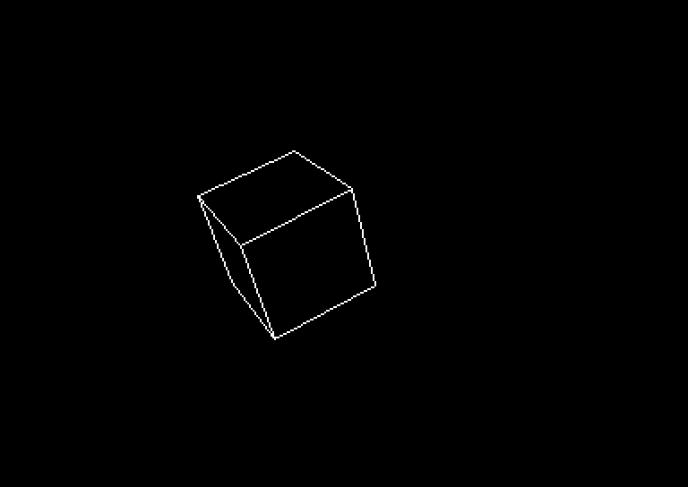

# c64-wireframe-cube

**A rotating 3D wireframe cube on the Commodore 64, computed live in 6502
assembly** — no precomputed animation, no lookup of final pixel positions.
Every frame does the rotation, projection, hidden-line removal and line drawing
from first principles, on a 1 MHz 8-bit CPU with no multiply instruction.

Version 1.1.0 · GPL-3.0 · 1,971 bytes



It runs at about **5.1 frames per second on an NTSC C64** and 4.6 on PAL,
which works out at roughly 200,000 CPU cycles per frame. Most of that goes on
the **96 signed 8×8 multiplies** each frame needs.

## Try it without building

Prebuilt `cube.prg` and `cube.d64` are checked in:

```
x64sc -autostart cube.d64
```

On a real machine, or to load it by hand:

```
LOAD"CUBE",8,1
RUN
```

`RUN` runs a BASIC stub that `SYS`es into the machine code. `LIST` shows the
version.

The program works on both NTSC and PAL machines; nothing in it is tied to one
video standard. NTSC is about 12% faster, because its CPU is faster and its
frames are shorter, so the cube tumbles a little more quickly.

## Building

Tools, with the versions this was built and tested with:

| Tool | Version | Why |
|---|---|---|
| [64tass](https://sourceforge.net/projects/tass64/) | 1.59.3120 | the 6502 cross-assembler the source is written for |
| [VICE](https://vice-emu.sourceforge.io/) | 3.10 | `c1541` builds the disk image; `x64sc` runs it |
| GNU Make | 4.4.1 | the build |
| Info-ZIP `zip` | 3.0 | only for `make dist` |

On Arch Linux: `pacman -S 64tass vice make zip`. On Debian or Ubuntu:
`apt install 64tass vice make zip`.

```
make            # assemble cube.prg, pack it into cube.d64
make run        # build and start it in VICE (NTSC; make run VICE_MODEL=pal)
make dist       # cube-<version>.zip
make clean
```

The assembler is invoked as `64tass --cbm-prg -o cube.prg cube.asm`. The
version number lives in one place, the `VERSION` line near the top of
`cube.asm`; the BASIC line and `make dist` both take it from there.

## What it does, every frame

1. **Rotate** all 8 cube vertices `(±32, ±32, ±32)` through the current
   `angle_x`, `angle_y`, `angle_z`. Three rotation stages per vertex, each
   computing `out = (a·cos + b·sin) / 64` and `out' = (b·cos − a·sin) / 64` in
   signed 8×8 → 16-bit arithmetic: **96 multiplies**.
2. **Decide which faces point at the viewer**, from the sign of each face's
   rotated Z normal (2 more multiplies).
3. **Project** each vertex with a perspective divide — one table lookup and
   one multiply per axis, no division routine (see below).
4. **Draw the visible edges** as Bresenham lines into the back buffer.
5. **Wait for the raster** to leave the visible area, then flip the VIC's view
   to the buffer just drawn.

Angles are 0–63, so a full turn is 64 steps, matching the 64-entry sine table.
The three axes advance at different rates (+1, +2, +1 per frame) to give an
interesting tumble.

## How it works

- **Quarter-square multiply.** The 6502 has no multiply instruction. Instead of
  shift-and-add, this uses `a·b = ⌊(a+b)²/4⌋ − ⌊(a−b)²/4⌋` with a single
  256-entry table of `⌊n²/4⌋`, split into low and high bytes at `$c000` and
  `$c100` (both page-aligned so indexing is a single `lda table,x`). A signed
  8×8 multiply becomes two indexed loads and a 16-bit subtract: **about 40
  cycles, against ~130 for shift-and-add**. Signed inputs collapse to
  magnitudes, because squaring drops the sign. The table is built at boot with
  an incremental adder, so no multiplies are needed to make it.
- **Hidden-line removal on a convex solid.** Six face-visibility flags come from
  the signs of the faces' rotated Z normals. Only three products are needed
  (`sin_x`, `sin_y·cos_x`, `cos_y·cos_x`) because opposite faces have opposite
  signs. An edge is drawn only if at least one of the two faces it joins points
  at the viewer, which hides the 3 or 4 edges round the back.
- **Double buffering across VIC banks.** Bitmap A is in VIC bank 0 (`$2000`,
  screen RAM `$0400`), bitmap B in bank 2 (`$a000` / `$8400`). The bitmap and
  screen sit at the same offsets within each bank, so `$d018` never changes and
  flipping is a single write to CIA2 `$dd00`. The viewer never sees a
  half-drawn frame.
- **Writing under the BASIC ROM shadow.** Bitmap B lives at `$a000`, where the
  CPU normally sees BASIC ROM. The VIC always reads RAM, so displaying it is
  fine, but `EOR (ptr),y` is read-modify-write from the CPU's point of view:
  with the ROM visible, the read half XORs pixel bits with BASIC bytecode.
  Clearing bit 0 of `$01` (LORAM) at boot maps the RAM underneath, so the CPU
  sees what the VIC sees.
- **Perspective without division.** Projecting properly means dividing by
  `DIST − z`, and the 6502 has no divide. It does not need one: the quotient
  is precomputed. `PERSP_TBL[z + 64]` holds `round(64 · DIST / (DIST − z))`
  for `DIST = 340`, so projection is a table lookup plus one signed multiply
  per axis, reusing the quarter-square multiply already here. That is 16
  extra multiplies against the 96 the rotation already costs. The nearest
  corner draws about 1.39x the size of the farthest — enough to read as
  solid without looking like a fish-eye lens.

  The sign matters and is easy to get backwards: `+Z` points **at** the
  viewer, which is the same convention `calc_face_vis` uses, so the divisor
  is `DIST − z` and **not** `DIST + z`. Inverting it draws far corners larger
  than near ones, which does not look obviously broken — it just looks like a
  badly distorted cube.
- **Inlined pixel plotting** inside the Bresenham loop: no JSR/RTS per pixel.
  Pixels are ORed in, not XORed. XOR looks equivalent when the back buffer is
  cleared every frame, but only while no pixel is written twice — and
  adjacent edges always write their shared vertex twice, so every corner of
  the cube lost a pixel. At a near-edge-on orientation two edges can run
  almost parallel a pixel apart and cancel each other outright, leaving the
  line dashed. `ORA` is the same 5 cycles and is idempotent.
- **Precomputed row addresses.** 200-entry tables map a Y coordinate to the
  address of pixel (0, Y). One `back_bmp_offset` variable (`$00` or `$80`),
  added to the high byte, redirects drawing to whichever bitmap is currently
  the back buffer.
- **Degenerate edges are skipped.** When a rotation projects both ends of an
  edge to the same point, the line call is skipped entirely.

## Files

| File | |
|---|---|
| `cube.asm` | the whole program, commented as a reading guide |
| `Makefile` | assemble, package, run |
| `cube.prg`, `cube.d64` | prebuilt, ready to load |
| `docs/cube.png` | the screenshot above |
| `LICENSE` | GNU GPL version 3 |

## Ideas not yet implemented

- **Exploit the cube's symmetry.** Every input vertex is `(±32, ±32, ±32)`, so
  the first rotation stage reduces to `±cos ± sin` scaled by 32, with no
  multiplies at all. That would cut 96 multiplies per frame to about 48.
- **8-bit Bresenham error.** The current error term is 16-bit; the coordinates
  are small enough that 8 bits might do, but the `2·err` in the standard
  formulation overflows, so it needs reformulating.

## References

- The quarter-square multiplication trick, and 6502 technique generally:
  [6502.org](http://6502.org/) and [codebase64](https://codebase64.org/).
- VIC-II memory mapping and banking, which is worth reading once before doing
  anything unusual with `$d018` and CIA2:
  [VIC-II on C64-Wiki](https://www.c64-wiki.com/wiki/VIC-II).

## License

Copyright (C) 2026 Jeff Francis.

This program is free software: you can redistribute it and/or modify it under
the terms of the **GNU General Public License, version 3 or later**, as
published by the Free Software Foundation. It comes with NO WARRANTY. See
[LICENSE](LICENSE) for the full text.
